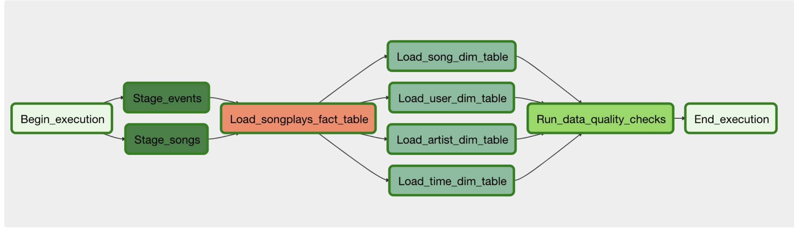

# Sparkify-Data-Pipeline

A music streaming company, Sparkify, has decided that it is time to introduce more automation and monitoring to their data warehouse ETL pipelines and come to the conclusion that the best tool to achieve this is Apache Airflow.

They have decided to create high grade data pipelines that are dynamic and built from reusable tasks, can be monitored, and allow easy backfills. They have also noted that the data quality plays a big part when analyses are executed on top the data warehouse and want to run tests against their datasets after the ETL steps have been executed to catch any discrepancies in the datasets.

Please note that the dataset utilized in this project, presented in JSON format, represents a subset of the original dataset which has been preprocessed as part of the course curriculum. This dataset is stored in an AWS S3 bucket and is publicly accessible.

The dataset comprises song data sourced from the Million Song Dataset and user activity data generated by an Event Simulator, both derived from the Million Song Dataset.

The data sources for this project remain consistent with previous projects:

Log data: s3://udacity-dend/log_data
Song data: s3://udacity-dend/song_data
Data is loaded into an Amazon Redshift Cluster with the objective of populating a star schema, comprising a fact table ("songplays") and dimension tables ("users", "songs", "artists", "time"). Additionally, two staging tables ("Stage_events" and "Stage_songs") are required.

Prior to executing the DAG workflow, it is necessary to create the tables in Redshift using the DDL script provided in create_tables.sql.

The project structure is organized as follows:

dags/project/sparkify_dag.py: Configuration file for the DAG to be executed in Airflow
 
plugins/operators:
stage_redshift.py: Operator for reading files from S3 and loading them into Redshift staging tables
load_fact.py: Operator for loading the fact table into Redshift
load_dimension.py: Operator for reading from staging tables and loading dimension tables into Redshift
data_quality.py: Operator for performing data quality checks
plugins/helpers/sql_statement.py: Redshift statements utilized in the DAG
 
 
Data quality checks are conducted to verify the successful loading of tables. If any table contains zero rows, the workflow will fail and an error message will be raised.

